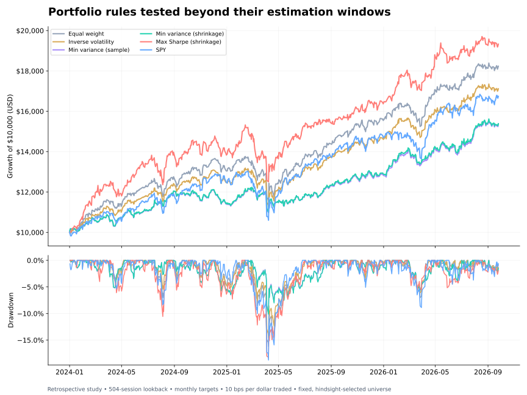

# Portfolio Research: Does Optimization Survive a More Realistic Backtest?

A reproducible, AI-assisted Python study of **five portfolio construction rules versus SPY**, using monthly walk-forward estimation, explicit holdings drift, transaction costs and constrained optimization.

**Main finding:** the maximum-Sharpe rule earned the highest return in the primary test, but simple equal weighting had the higher realized Sharpe ratio. Minimum variance reduced drawdowns at the cost of return. More complex construction did not automatically deliver a better risk-adjusted result.



## Results at a glance

January 2, 2024–September 25, 2026 · 686 sessions · 33 monthly allocations · 504-session estimation window · 10 bps per dollar traded.

| Portfolio | CAGR | Volatility | Sharpe | Max drawdown |
|---|---:|---:|---:|---:|
| Equal weight | 24.69% | 12.73% | 1.49 | −16.20% |
| Inverse volatility | 21.82% | 11.43% | 1.44 | −14.51% |
| Min variance — sample | 17.04% | 10.54% | 1.17 | −9.99% |
| Min variance — shrinkage | 17.15% | 10.51% | 1.19 | −10.16% |
| Max Sharpe — shrinkage | 27.39% | 15.26% | 1.41 | −18.39% |
| SPY | 20.84% | 15.58% | 1.04 | −18.76% |

Hypothetical results, net of modeled costs, in USD. The fixed stock universe was chosen with hindsight. This is **not** a live track record, an untouched research holdout or proof of persistent alpha.

The maximum-Sharpe rule's Sharpe difference versus equal weight was −0.08, with a descriptive 95% paired block-bootstrap interval of **[−0.86, 0.50]**. That does not establish superiority for either rule.

## What makes this more than an efficient-frontier exercise?

- **Walk-forward targets:** refit each month, with data ending a full session before assumed execution.
- **Actual portfolio accounting:** holdings drift between rebalances; costs are paid from equity without borrowing.
- **Practical target constraints:** long only, fully invested, 15% per stock and 35% per sector.
- **Estimator comparison:** sample versus Ledoit–Wolf shrinkage covariance, plus simple benchmarks.
- **Robustness:** all three lookbacks and four cost scenarios reported, without selecting the best result as the headline.
- **Uncertainty:** 1,000 paired block-bootstrap replications for Sharpe differences.
- **Auditability:** source data hash, timing log, trade log, monthly allocations and 11 focused regression tests.

## Start here

1. [Full results and limitations](outputs/RESULTS.md)
2. [Methodology and model audit](METHODOLOGY.md)
3. [Executed notebook walkthrough](portfolio_research.ipynb)
4. [Interview discussion guide](INTERVIEW_GUIDE.md)

## Reproduce

Python 3.12 is the validated environment. Download this repository, open a terminal in its folder, then:

```bash
python -m venv .venv
source .venv/bin/activate
# Windows: .venv\Scripts\activate
python -m pip install -r requirements.txt
python -m unittest discover -s tests -v
python run_analysis.py
```

The included price snapshot makes the default run **offline**. Exact versions used for the supplied run are in `requirements-lock.txt` and `outputs/run_manifest.json`. Minor numerical differences may occur across platforms or dependency versions.

To intentionally re-download the fixed historical window:

```bash
python run_analysis.py --refresh
```

The provider may revise adjusted prices. Refreshing replaces the snapshot and its hash; it does not extend the end date. The Yahoo chart endpoint is unofficial and may change or rate-limit requests. Provider failures stop the run; there is no fallback to fabricated data.

To open the optional notebook locally:

```bash
python -m pip install jupyterlab
jupyter lab portfolio_research.ipynb
```

## Layout

| Path | Contents |
|---|---|
| `src/data.py` | Strict adjusted-close ingestion and cache validation |
| `src/research.py` | Targets, constraints, costs, backtest, metrics and bootstrap |
| `src/universe.py` | Fixed 20-stock universe and sector mapping |
| `run_analysis.py` | Complete study and figure/report generation |
| `tests/test_research.py` | Timing, cost, drift, metric and constraint tests |
| `data/` | Adjusted-close snapshot and source provenance |
| `outputs/` | Results, trades, timing, allocations, sensitivity and charts |
| `protocol.json` | Primary specification and sensitivity grid recorded before this run |

## Universe

AAPL, MSFT, NVDA, AMZN, GOOGL, META, JPM, BAC, XOM, CVX, JNJ, LLY, UNH, CAT, COST, PG, KO, NEE, HD and DIS. Benchmark: SPY.

## Research integrity

The project separates each optimizer's estimation data from subsequent returns, but that **does not eliminate hindsight in research design**. The universe includes surviving firms, sector labels are static, and the model was developed retrospectively. Costs are simplified; taxes, currency conversion and market impact are omitted. No terminal sale is charged. Caps apply at rebalances and may be exceeded through drift. A constant 4% risk-free assumption is used throughout.

Built with AI assistance (OpenAI Codex). Code and results are included for inspection and reproduction; AI assistance is not a substitute for understanding or independent validation. Market data remains third-party material subject to its provider's terms.
