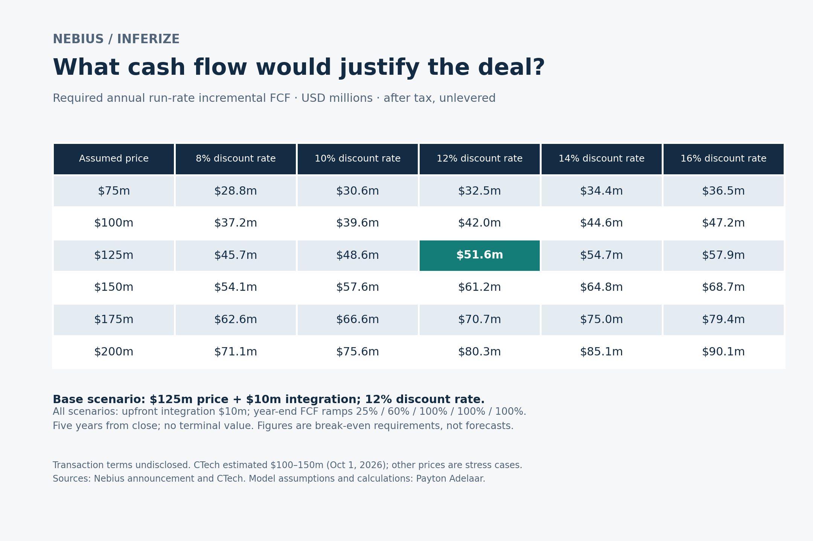

# Nebius / Inferize: what cash flow would justify the acquisition?

An illustrative reverse discounted cash flow analysis by Payton Adelaar. Prepared October 2, 2026. All financial amounts are USD millions.

## Question and result

What annual incremental free cash flow would make an assumed acquisition outlay break even on a discounted basis?

With a **$125m assumed purchase price**, **$10m upfront integration cost**, **12% discount rate**, and a five-year benefit stream ramping **25% / 60% / 100% / 100% / 100%**, the required full-run-rate annual after-tax unlevered free cash flow is **$51.6m**. No terminal value is included. This is a required cash-flow threshold, not a forecast, price target, or finding that the actual acquisition creates value.



At a 12% discount rate, the $100m–$150m price scenarios require $42.0m–$61.2m of full-run-rate annual FCF, holding other assumptions constant.

## What is known, reported, and assumed

| Input or statement | Status | Treatment |
|---|---|---|
| Acquisition announced October 1, 2026 | Company disclosure | Confirmed by Nebius announcement |
| Inferize technology is intended to improve GPU utilization and inference economics | Company rationale | Potential mechanism, not demonstrated financial savings |
| Actual consideration and deal structure | Undisclosed | No inference about cash/stock mix, earnouts, acquired cash or debt |
| $100m–$150m estimated deal value | CTech media estimate | Informs scenario range; not company-confirmed consideration |
| Purchase prices $75m–$200m | Model scenarios | Includes stress cases outside the media range |
| $125m central price | Model assumption | Midpoint of reported estimate, not an independently estimated fair value |
| $10m integration cost | Model assumption | After-tax cash cost paid at close; no estimate from management |
| 8%–16% discount rates; 12% central | Model assumptions | Hurdle-rate sensitivity, not an estimated company WACC |
| Five-year horizon, annual year-end cash flows | Model assumption | Years measured from close, not calendar reporting years |
| Benefit ramp of 25%, 60%, then 100% | Model assumption | No management guidance used |
| Zero terminal value | Model boundary | Excludes all cash flows after the horizon; not a claim that technology becomes worthless |

Sources accessed October 2, 2026:

1. [Nebius acquisition announcement, October 1, 2026](https://nebius.com/newsroom/nebius-acquires-inferize-to-strengthen-nebius-token-factorys-production-inference-stack). Transaction terms were not disclosed.
2. [CTech / Meir Orbach, October 1, 2026](https://www.calcalistech.com/ctechnews/article/byzggtiqgx). Reports an estimated $100m–$150m deal value. This analysis treats the dollar estimate as USD.

## Method

Let P be assumed purchase consideration, I upfront integration cost, r the annual discount rate, a_t the benefit ramp, and F full-run-rate annual incremental FCF:

```text
NPV = -(P + I) + sum(F * a_t / (1 + r)^t), for t = 1 ... H
Required F = (P + I) / sum(a_t / (1 + r)^t)
```

The base case pays $135m at time zero. Required year-end cash flows are approximately $12.9m, $31.0m, $51.6m, $51.6m and $51.6m. Their discounted sum is $135m. Breaking even means earning the assumed discount rate over the modeled stream, not merely recovering the nominal outlay.

The purchase price is treated as a cash-equivalent economic outlay at close. This deliberately abstracts from actual financing, settlement terms, acquired liabilities and cash, transaction fees, and purchase-accounting tax effects. It is not a full enterprise-to-equity valuation or EPS accretion/dilution model.

FCF is **incremental to a no-acquisition counterfactual, after tax and before financing costs**. It must reflect ongoing operating expenses, maintenance/development investment and working capital needed to sustain the benefits. Upfront integration is modeled separately, so it must not be deducted again from the annual benefit stream. Acquired standalone cash flow, if any, and integration benefits together would contribute to this requirement; no standalone cash flow is estimated here.

Operational benefits could arise from additional profitable demand served or a reduction in required infrastructure spending. Utilization alone is not cash flow. Extra demand requires customers and retained pricing; avoided capex may be temporary or uneven. Do not count the same released capacity both as additional revenue capacity and avoided hardware spending. The model solves for the aggregate FCF hurdle and does not claim an operational bridge can achieve it.

## Timing and durability sensitivity

| Scenario at $125m price, $10m integration and 12% | Benefit ramp | Required annual full-run-rate FCF |
|---|---|---|
| Base: five years from close | 25%, 60%, 100%, 100%, 100% | $51.6m |
| Delay one year; keep year-five end date | 0%, 25%, 60%, 100%, 100% | $73.8m |
| Delay one year; shift whole stream to end in year six | 0%, 25%, 60%, 100%, 100%, 100% | $57.8m |
| Extend benefit horizon to seven years | 25%, 60%, 100%, 100%, 100%, 100%, 100% | $37.8m |

The fixed-end-date delay case loses a full year of benefits as well as delaying the remaining cash flows. It should not be described as the pure time-value cost of a one-year delay. The shifted-stream case isolates that effect: its required run rate increases exactly 12%. Extending durability lowers the hurdle, illustrating the importance of the finite-horizon assumption.

These scenarios are not probability-weighted and do not assign a likelihood of success. Zero terminal value excludes potential long-term benefits, while the benefit ramp and stable full-run-rate FCF may be optimistic. The overall case should not be labelled conservative. Cash-flow evidence is insufficient to conclude whether the actual price was attractive or whether NBIS shares are attractive.

## Reproduce

From this directory, Python 3.10 or later:

```bash
python run_analysis.py
python -m unittest -v test_model.py
```

Numeric outputs and tests use only the standard library. To reproduce the figure:

```bash
python -m pip install -r requirements.txt
python run_analysis.py --figure
```

Change the `Scenario` defaults in `model.py` for a different central scenario. The price and rate grids are in `run_analysis.py`. Every numeric output is recomputed from unrounded inputs; display rounding is applied only to presentation.

Files:

- `model.py`: validated scenario inputs and reverse DCF calculation.
- `test_model.py`: eight tests covering analytic benchmarks, discounted cash-flow reconciliation, monotonicity, timing, horizon and invalid inputs.
- `run_analysis.py`: reproducible results, sensitivity grid and optional figure.
- `outputs/results.json`: assumptions and results for all timing/durability cases.
- `outputs/sensitivity.csv`: full-precision price/rate grid.
- `outputs/base_cash_flows.csv`: annual base-case FCF, discount factors and present values.
- `outputs/sensitivity.png`: presentation figure.
